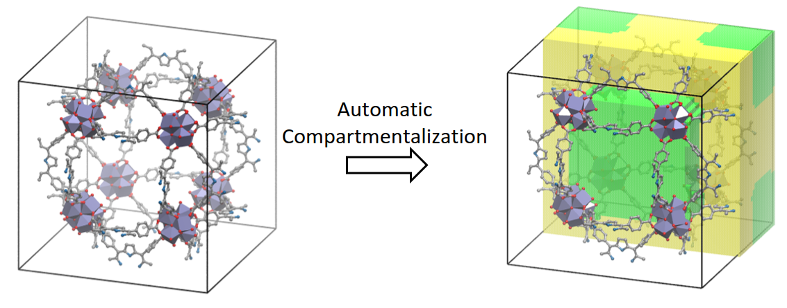

# pyCOSMOS: python for Compartmentalization Of Solid Metal-Organic framework Structures
pyCOSMOS partitions the unit cell of a MOF into distinct pore compartments. 
The unit cell is subdivided into cubelets, which are then classified into a pore types. 
For instance, PCN-224 comprises two pore types. 
Through the use of pyCOSMOS, the cubelets within the unit cell are designated as green or yellow, representing the channel and interaction pores, respectively.


## Requirements
1. cython: `pip install cython`
2. mayavi (for visualization): `pip install mayavi`
3. openbabel (for converting cif to pdb): `sudo snap install openbabel`


## How to use?
### Build the cython file:  
`python3 setup_periodic_distance.py build_ext --inplace`
It will generate a folder `build` and the file `periodic_distance.cpython-311-x86_64-linux-gnu.so`

### Required: Perform Zeo++ pore size distribution calculation
1. Install Zeo++ from: http://zeoplusplus.org/. After successful installation, `network` executable is generated.
2. Perform psd calculation using: `./network -ha -vpsd 1.657 1.657 50000 Structure.cif`. This will generate *vpsdpts files.
Here 1.657 is the probe radius and 50,000 monte carlo insertions are attempted to calculate the pore size distribution.


## Inputs

input.txt
```
vpsdpts  file.vpsdpts
lx       38.8050
ly       38.8050
lz       38.8050
alpha    90.0000
beta     90.0000
gamma    90.0000
npore    2
eps      2.500
nmin     25
```

1. vpsdpts: pore size distribution file from Zeo++ 
2. npore: Number of pore types. (If you don't know this, run this code with guess value of 1, 2, and 3 in this order)
3. lx, ly, lz, alpha, beta, gamma are unit cell dimensions.
4. eps and nmin are the parameters of the DBSCAN clustering algorithm. 

To run pycosmos:
```bash
python pyCOSMOS/src/main.py input.txt
```

## Outputs
The results of the algorithm is in the form of a pore type matrix of size $$(lx \times ly \times ly)$$.

csv files:
1. `pore_type_matrix_with_cluster_labels.csv`
2. `pore_type_matrix_with_pore_type_labels.csv`

html file (can be viewed on browser)-
1. `pore_type_matrix_with_cluster_center_labels.html`
2. `pore_type_matrix_with_pore_type_labels.html`
3. `geometric_points_with_cluster_labels_for_pore_type_*Npores.html`

xyz files: for each primary bin in the pore size distribution. Additional xyz files for each cluster within a bin.

png files: characteristic snapshots of the framework with pores visualized as cages or channels.
